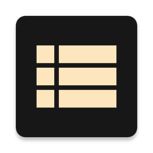
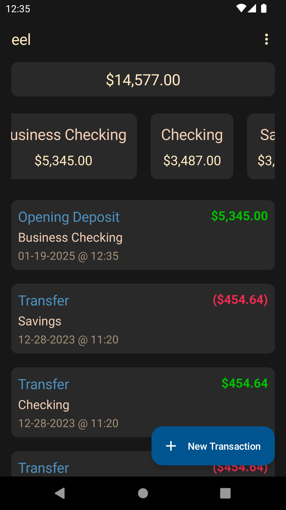
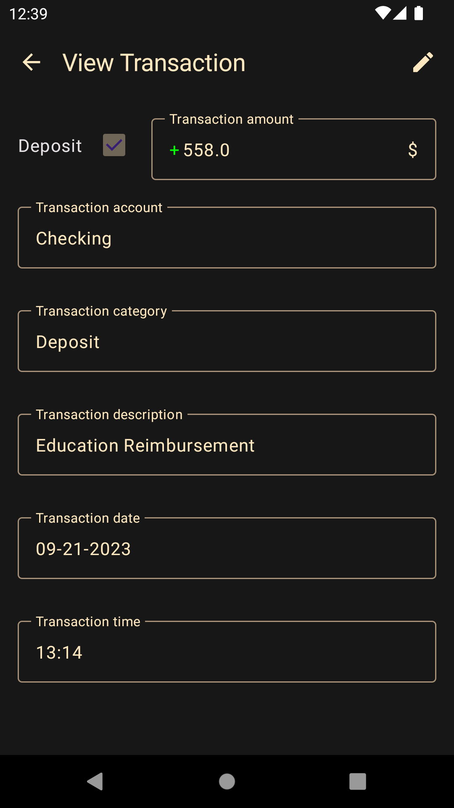
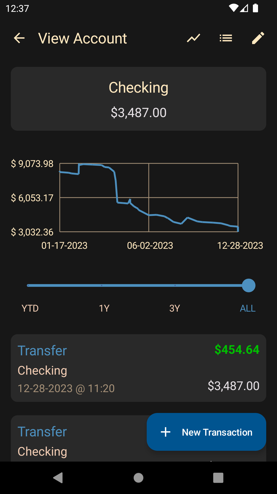

  

    
    <h1> EEL Easy Ledger (EEL) </h1>
  

## Description
Android application to track assets, cash accounts and liabilities utilizing modern android design standards.

## Screenshots

  
  
  

## Features
- Track transactions across bank accounts
- Track appreciation and depreciation of assets
- Search and filter through all transactions
- Import/ export transaction ledger in human readable format
- Multiple user interface themes
- Free and open source
- No internet usage ensuring privacy and security

## What EEL is
- A replacement for the "transaction register" found in checkbooks
- A tool to record unrealized gains in assets
- An instrument of convenience by providing search and sort ability for historical and current transactions

## What EEL is not
- A budgeting application
- A tool which integrates/ connects to online banking and financial websites
- An application to store credit card or other non-bank/ non-brokerage transactions
